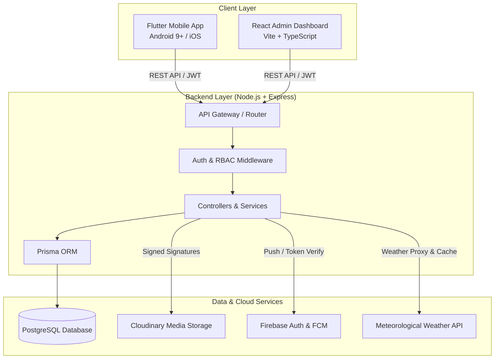

# 🌾 Kisan Mithar (కిసాన్ మిత్ర / किसान मित्र / ಕಿಸಾನ್ ಮಿತ್ರ)

<p align="center">
  
</p>

<p align="center">
  <strong>High-Density Fruit Orchard Planning & Tele-Agronomy Advisory Platform</strong><br>
  Empowering Indian smallholder farmers with scientific orchard transformation, certified agronomist consultations, hyperlocal weather intelligence, and 100% offline resiliency.
</p>

<p align="center">
  
  
  
  
  
  
</p>

---

## 📖 Table of Contents
- [🌟 Key Features](#-key-features)
  - [1. Mobile Application (Flutter)](#1-mobile-application-flutter)
  - [2. Agronomist & Admin Web Dashboard (React + TypeScript)](#2-agronomist--admin-web-dashboard-react--typescript)
  - [3. Backend API Engine (Node.js + PostgreSQL + Prisma)](#3-backend-api-engine-nodejs--postgresql--prisma)
- [🏛️ System Architecture](#️-system-architecture)
- [📁 Repository Structure](#-repository-structure)
- [🌐 Multilingual Support](#-multilingual-support)
- [🚀 Getting Started](#-getting-started)
  - [Prerequisites](#prerequisites)
  - [1. Backend Setup](#1-backend-setup)
  - [2. Flutter Mobile App Setup](#2-flutter-mobile-app-setup)
  - [3. Admin Dashboard Setup](#3-admin-dashboard-setup)
- [🧪 Running Automated Tests](#-running-automated-tests)
- [🔒 Security, Hardening & Offline Resiliency](#-security-hardening--offline-resiliency)
- [📱 Google Play Store Publishing](#-google-play-store-publishing)
- [📄 License & Compliance](#-license--compliance)

---

## 🌟 Key Features

### 1. Mobile Application (Flutter)
- **Guided 3-Step Orchard Planning Wizard**:
  - **Step 1 — Land Photography**: 4-angle visual inspection (North, South, East, West) with real-time camera viewfinder, retake, and zoom preview.
  - **Step 2 — High-Precision GPS Boundary**: Native hardware GPS auto-detection with reverse-geocoding (Village, Mandal, District) and interactive Google Maps pin drop.
  - **Step 3 — Agronomic Specifications**: Soil classification, water sources, irrigation type, fruit crop preferences (Mango, Guava, Dragon Fruit, Pomegranate, Citrus, Custard Apple, Amla), and audio voice note recorder for dialect-specific notes.
- **5-Stage Real-Time Survey Tracker**:
  - `Submitted` ➔ `Under Review` ➔ `Agronomist Assigned` ➔ `Plan Ready` ➔ `Completed`.
- **11-Section Orchard Feasibility Report Viewer**:
  - In-app visual preview & offline downloadable PDF covering plant spacing, soil conditioning, drip irrigation layouts, capital cost estimates, 5-year ROI projections, maintenance calendars, and government subsidies (MIDH, PMKSY).
- **Tele-Agronomy & Expert Consultations**:
  - Book 1-on-1 consultations across Voice, Video, and Chat modes with preferred time slots and language matching.
  - Consultation history cards, digital prescription viewer, and follow-up reminder alarms.
- **Hyperlocal Weather & Agricultural Spray Alerts**:
  - Live temperature, humidity, wind speed, hourly forecast strip, 7-day trend, interactive `fl_chart` rainfall graph, and prominent spray-delay alert banners.
- **Farmer Profile & Offline Document Vault**:
  - Edit farmer profile, switch app dialect in real time, and access locally cached PDFs without internet.

---

### 2. Agronomist & Admin Web Dashboard (React + TypeScript)
- **Agricultural Glassmorphism Design**: High-contrast, responsive UI tailored for agronomy teams and agricultural administrators.
- **Request Inspection Center**:
  - Comprehensive survey viewer displaying farmer credentials, multi-angle land photo lightbox, interactive GPS coordinates map, and custom audio player with waveform controls for farmer voice notes.
- **11-Section Feasibility Report Builder**:
  - Interactive web form enabling experts to formulate tailored orchard plans, compute spacing matrices, and generate official stamped PDFs using client-side `jsPDF`.
- **Consultation Queue & Prescription Issuer**:
  - Manage incoming consultation queues, assign agronomists, and attach digital crop prescriptions.
- **Analytics & Operations KPIs**:
  - Live metrics for turnaround time (TAT), requests per crop type, consultation distribution, and district heatmaps.

---

### 3. Backend API Engine (Node.js + PostgreSQL + Prisma)
- **Database Architecture (Prisma ORM)**:
  - Strongly typed relational models for `Farmer`, `Expert`, `Admin`, `OrchardRequest`, `OrchardReport`, `Consultation`, `Notification`, and `Device`.
- **Security & Authentication**:
  - Firebase Admin SDK ID token verification with custom signed JWT tokens for subsequent session authentication.
  - Role-Based Access Control (`RBAC`) protecting Farmer, Agronomist, and Admin routes.
  - IP-based rate limiting (`express-rate-limit`) and centralized structured error handling.
- **Cloud Integrations**:
  - **Cloudinary**: Signed signature generation (`/api/uploads/sign`) for direct client uploads without exposing master API secrets.
  - **Firebase Cloud Messaging (FCM)**: Push notification dispatch for plan updates and consultation reminders.
  - **Server-Side Weather Proxy**: Securely queries external meteorological APIs and caches responses.

---

## 🏛️ System Architecture



---

## 📁 Repository Structure

```
Kissan-Mithar-App/
├── .vscode/                      # Shared IDE workspace configuration
├── kissan_mithar_logo.PNG                  # Brand logo and application icon
│
├── kissan_mithar/                # 📱 Flutter Mobile Application
│   ├── android/                  # Android native project (minSdk 24, R8 shrinking)
│   ├── ios/                      # iOS native project
│   ├── assets/                   # Vector illustrations, icons & logos
│   ├── lib/
│   │   ├── core/                 # Config, colors, themes, network, routing, services
│   │   │   ├── constants/        # AppColors, agricultural constants
│   │   │   ├── network/          # Dio client and REST endpoint definitions
│   │   │   ├── routing/          # GoRouter configuration
│   │   │   ├── services/         # Cloudinary, SMS, OfflineSync, LocalNotification
│   │   │   └── theme/            # Material 3 theme & typography
│   │   ├── features/             # Modular feature packages
│   │   │   ├── activity/         # Request tracking & activity history
│   │   │   ├── auth/             # Phone OTP verification & session management
│   │   │   ├── consultation/     # Booking, detail, history & prescriptions
│   │   │   ├── home/             # Agricultural home dashboard & navigation shell
│   │   │   ├── language_selection# Regional dialect picker
│   │   │   ├── legal/            # Privacy Policy & Terms of Use tabs
│   │   │   ├── notifications/    # In-app notifications & permission prompts
│   │   │   ├── orchard_planning/ # 3-step wizard, camera, GPS, audio & report
│   │   │   ├── profile/          # Farmer profile & cached PDF downloads
│   │   │   ├── splash/           # Animated splash screen
│   │   │   └── weather/          # Live forecast, rainfall chart & spray alerts
│   │   ├── l10n/                 # ARB translation files (EN, TE, HI, KN)
│   │   └── main.dart             # Root application entry point
│   └── test/                     # Automated unit and widget test suites
│
├── backend/                      # ⚙️ Node.js + Express + PostgreSQL Backend
│   ├── prisma/                   # Prisma schema & database seed script
│   ├── src/
│   │   ├── config/               # DB pool, Firebase, Cloudinary, Zod env schema
│   │   ├── controllers/          # Request handlers for all domain endpoints
│   │   ├── middleware/           # Firebase Auth, RBAC, RateLimiter, ErrorHandler
│   │   ├── models/               # Prisma client singleton
│   │   ├── routes/               # Express REST route definitions
│   │   ├── services/             # Core business logic & external integrations
│   │   ├── types/                # TypeScript interface definitions
│   │   ├── app.ts                # Express application configuration
│   │   └── server.ts             # HTTP server bootstrap
│   └── test/                     # Backend API integration tests
│
├── admin_dashboard/              # 💻 React + TypeScript Admin Dashboard
│   ├── src/
│   │   ├── api/                  # Axios HTTP client and API service wrappers
│   │   ├── components/           # Reusable UI (StatCard, AudioPlayer, ImageGallery, MapPreview)
│   │   ├── pages/                # Login, Dashboard, RequestsList, RequestDetail, ReportBuilder, Consultations
│   │   ├── services/             # AuthStore (JWT storage) and jsPDF Generator
│   │   ├── styles/               # Glassmorphism design tokens & styles
│   │   ├── types/                # Domain TypeScript types
│   │   ├── App.tsx               # Route declarations and role-based guards
│   │   └── main.tsx              # React DOM root entry point
│   └── vite.config.ts            # Vite bundler configuration
│
└── play_store_listing/           # 📦 Google Play Store Publishing Package
    ├── README.md                 # Store metadata, graphic guidelines & checklist
    ├── en_US.md                  # English listing copy
    ├── te_IN.md                  # Telugu listing copy (తెలుగు)
    ├── hi_IN.md                  # Hindi listing copy (हिंदी)
    └── kn_IN.md                  # Kannada listing copy (ಕನ್ನಡ)
```

---

## 🌐 Multilingual Support

The mobile app natively supports 4 major Indian languages with zero external dependencies:

| Language | Code | Native Name | ARB Resource |
| :--- | :---: | :---: | :--- |
| **English** | `en` | English | [`lib/l10n/app_en.arb`](kissan_mithar/lib/l10n/app_en.arb) |
| **Telugu** | `te` | తెలుగు | [`lib/l10n/app_te.arb`](kissan_mithar/lib/l10n/app_te.arb) |
| **Hindi** | `hi` | हिंदी | [`lib/l10n/app_hi.arb`](kissan_mithar/lib/l10n/app_hi.arb) |
| **Kannada** | `kn` | ಕನ್ನಡ | [`lib/l10n/app_kn.arb`](kissan_mithar/lib/l10n/app_kn.arb) |

Farmers can switch languages seamlessly from the **Profile Screen** or the first-launch **Language Selector**, instantly hot-reloading the entire UI.

---

## 🚀 Getting Started

### Prerequisites
- **Flutter SDK**: `>= 3.19.0`
- **Node.js**: `>= 18.0.0` & `npm >= 9.0.0`
- **PostgreSQL**: `>= 14.0`
- **Android Studio / Xcode**: For mobile emulator or device deployment

---

### 1. Backend Setup

```bash
cd backend

# 1. Install dependencies
npm install

# 2. Configure environment variables
cp .env.example .env
# Edit .env with your DATABASE_URL, JWT_SECRET, FIREBASE_*, CLOUDINARY_* values

# 3. Run Prisma migrations & seed database
npx prisma migrate dev --name init
npm run seed

# 4. Start backend server in development mode
npm run dev
# Server starts on http://localhost:5000
```

---

### 2. Flutter Mobile App Setup

```bash
cd kissan_mithar

# 1. Install Flutter dependencies
flutter pub get

# 2. Configure environment variables
cp .env.example .env
# Update API_BASE_URL to point to your backend (e.g. http://10.0.2.2:5000 for Android Emulator)

# 3. Generate localization classes
flutter gen-l10n

# 4. Run application
flutter run
```

---

### 3. Admin Dashboard Setup

```bash
cd admin_dashboard

# 1. Install dependencies
npm install

# 2. Start development server
npm run dev
# Dashboard launches at http://localhost:5173
```

---

## 🧪 Running Automated Tests

### Flutter Test Suite
```bash
cd kissan_mithar
flutter test
```
*Executes unit tests for `OrchardPlanningNotifier` multi-step state machine, offline draft queues, and phone/OTP auth flow validators.*

### Backend Test Suite
```bash
cd backend
npm test
```
*Validates REST API endpoints, JWT authorization middleware, and survey submission pipelines.*

---

## 🔒 Security, Hardening & Offline Resiliency

1. **Android Low-RAM Optimization**:
   - `minSdk` set to **24** (compatible with Android 9.0+ budget devices).
   - Code and resource shrinking enabled (`isMinifyEnabled = true`, `isShrinkResources = true`).
   - Custom ProGuard rules (`proguard-rules.pro`) preserve Riverpod, Google Maps, and Local Notification reflection models.
2. **Offline-First Resilience**:
   - **Draft Auto-Saving**: Incomplete orchard surveys survive unexpected power loss or app restart.
   - **Offline Sync Queue**: Background retries automatically upload cached surveys when internet connectivity is restored.
   - **Local Notification Service**: Follow-up consultation alarms and spray warnings trigger accurately without requiring network connection.
3. **Strict Android Permissions**:
   - Audited to the absolute minimum: `CAMERA`, `ACCESS_FINE_LOCATION`, `READ_MEDIA_IMAGES`, `POST_NOTIFICATIONS`, and `SCHEDULE_EXACT_ALARM`.

---

## 📱 Google Play Store Publishing

Complete localization copy, keyword metadata, feature bullets, and graphics checklists are documented in the [`play_store_listing/`](play_store_listing/) directory:
- [🇬🇧 English Listing (`en_US.md`)](play_store_listing/en_US.md)
- [🇮🇳 Telugu Listing (`te_IN.md`)](play_store_listing/te_IN.md)
- [🇮🇳 Hindi Listing (`hi_IN.md`)](play_store_listing/hi_IN.md)
- [🇮🇳 Kannada Listing (`kn_IN.md`)](play_store_listing/kn_IN.md)

---

## 📄 License & Compliance
- **Farm Data Confidentiality**: Farmer agricultural land records and GPS coordinates are 100% private and protected by agronomic advisory compliance guidelines.
- Developed with ❤️ for Indian farmers.
